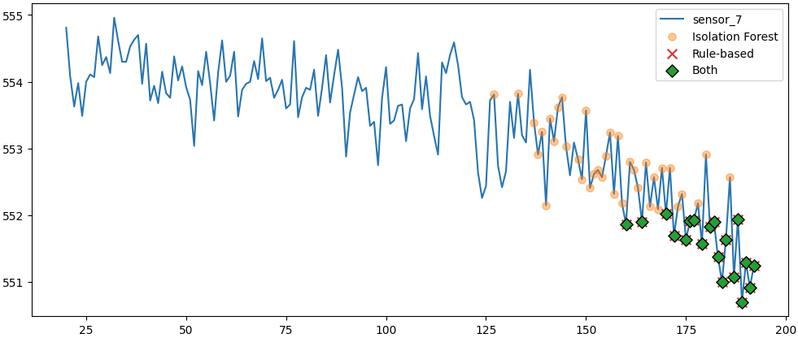

# Anomaly Detection on Multivariate Sensor Time-Series (NASA CMAPSS)

## Problem Statement
In condition-monitoring systems, the goal is to detect **early degradation** in complex equipment before a final failure occurs.  
This is challenging because real-world sensor data is noisy, multi-dimensional, and often lacks precise anomaly labels.

In this project, I built and evaluated anomaly detectors on multivariate sensor time-series data, comparing a **rule-based baseline** against a **machine learning–based (unsupervised) model** under a **safety-oriented objective** (prioritizing high recall).

---

## Dataset
This project uses the **NASA CMAPSS Turbofan Engine Degradation Simulation dataset (FD001)**.  
Each `engine_id` represents a full lifecycle time-series (cycles) of a single engine with multiple sensor measurements and operating settings.

Because the dataset does not provide explicit anomaly labels per timestep, a **proxy degradation label** is used for evaluation:
- `is_degraded = 1` for the **last 20%** of each engine’s lifecycle (`life_fraction >= 0.8`)
- `is_degraded = 0` otherwise  
This proxy label is used **only for evaluation**, not for training.

---

## Feature Engineering
To capture temporal context in sensor readings, I created rolling-window features per engine:
- rolling mean
- rolling standard deviation

These features convert raw sensor values into a representation that better reflects **trend and volatility changes** over time.

---

## Rule-Based Baseline
As a baseline, I implemented a **Z-score threshold detector**:
- estimate “normal” behavior from early-life data
- flag anomalies when the signal deviates beyond a fixed threshold

**Strengths:** simple and interpretable  
**Limitations:** tends to detect only strong deviations and may miss subtle early degradation

---

## ML-Based Detection (Isolation Forest)
I implemented an unsupervised **Isolation Forest** detector trained only on early-life (“normal”) behavior:
- Train on early-life data (`life_fraction <= 0.3`)
- Predict anomalies across the full lifecycle

Isolation Forest was chosen because it:
- works well in **unsupervised** settings
- handles **multivariate** sensor features
- does not assume a specific data distribution
- scales well and is widely used as an industry baseline for anomaly detection

---

## Evaluation Strategy
### Engine-level evaluation
Each engine represents a complete time-series unit with its own baseline behavior.  
To avoid leakage and ensure realistic generalization, tuning was done using an **engine-level split**:

- Train engines and evaluation engines are disjoint
- Train only on early-life data from train engines
- Evaluate on full lifecycles of unseen engines

### Metric focus
This project prioritizes **high recall** (minimizing missed degradation) even at the cost of more false alarms:
- Precision: fraction of detected anomalies that fall within the degraded region
- Recall: fraction of degraded-region points detected as anomalies

---

## Results & Trade-offs

| Method | Precision | Recall | Notes |
|---|---:|---:|---|
| Rule-based (Z-score) | ~0.94 | ~0.41 | Conservative, highly interpretable; misses early degradation |
| Isolation Forest (tuned) | ~0.51 | ~0.97 | Safety-oriented; detects degradation early but triggers more false alarms |

**Interpretation**
- The rule-based detector is conservative: when it triggers, it is usually correct (high precision), but it misses much of the degradation phase (low recall).
- The tuned Isolation Forest is aggressive: it detects degradation much earlier (high recall), but produces more false positives (lower precision).
- This highlights the core trade-off in monitoring systems: **early detection vs. alert fatigue**.

---

## Final Figure
The figure below overlays anomalies detected by both approaches on a single engine lifecycle:

- Rule-based anomalies (late, strong deviations)
- Isolation Forest anomalies (earlier, subtler deviations)
- Overlapping detections (“Both”)

> 

---

## Conclusions
- Rule-based thresholds provide strong interpretability and high precision but often miss early-stage degradation.
- Isolation Forest improves recall by detecting multivariate behavioral shifts earlier in the lifecycle.
- Higher recall comes with increased false positives, emphasizing the need to align model choice with system priorities.
- Engine-level evaluation is essential for time-series unit data to avoid leakage and measure real generalization.
- For safety-oriented scenarios, a tuned Isolation Forest is a strong baseline; for operational simplicity, rule-based methods may be preferred.

